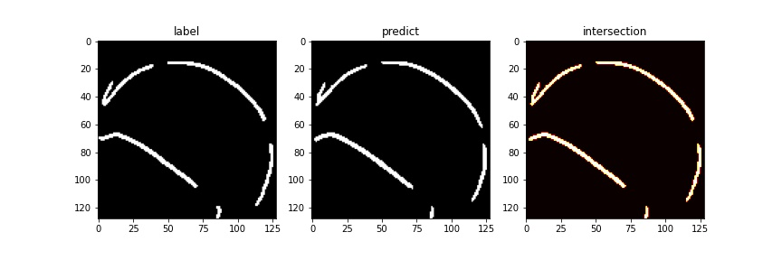

# CNN-Based Line Detection With An Omnidirectional Camera 

| Obsolete Template-Matching-Based | CNN-Based |
| -------------------------------- | --------- |
|  |  |
| 😟  | 😘 |
| very slow (about 5fps) | fast (30fps ~) |
| not accurate | very accurate |
| a lot of preprocessing | end-to-end model |
| prone to weather, obstacles | robust to them |


## Overview of both methods

### Template Matching Based

1. multiple filtering
2. ---
3. plain transformation
4. template matching
5. threshold

### CNN Based

1. confidence_map = model.predict(input_image)


### Data Preparation
```python
img_height = 128
img_width = 128
img_channels = 3
annotation_channels = 1
batch_size = 32

def get_single_frame(img_path, annotation_path):
    img = tf.io.read_file(img_path)
    img = tf.image.decode_jpeg(img, channels=img_channels)
    img = tf.image.convert_image_dtype(img, tf.float32)
    img = tf.image.resize(img, [img_height, img_width])

    label_img = tf.io.read_file(annotation_path)
    label_img = tf.image.decode_jpeg(label_img, channels=annotation_channels)
    label_img = tf.image.convert_image_dtype(label_img, tf.float32)
    label_img = tf.image.resize(label_img, [img_height, img_width])

    return {"image": img, "label": label_img} 

    ds = tf.data.Dataset.from_tensor_slices((image_files, annotation_files))
    ds = (
        train_ds.map(
            get_single_frame, num_parallel_calls=tf.data.experimental.AUTOTUNE
        )
        .batch(batch_size)
        .prefetch(buffer_size=tf.data.experimental.AUTOTUNE)
    )
```

### Model Architecture
```python
input_img = Input(shape=(img_height, img_width, img_channels))
x = BatchNormalization()(input_img)
x = Conv2D(16, 3, padding='same', activation='relu')(x)
x = BatchNormalization()(x)
x = Dropout(0.3)(x)

# Encoder
for c in [32, 64, 128]:
    x = Conv2D(c, 3, padding='same', activation = 'relu')(x)
    x = Conv2D(c, 3, padding='same', activation = 'relu')(x)
    x = MaxPool2D()(x)
    x = BatchNormalization()(x)
    x = Dropout(0.3)(x)

# Decoder
for c in [128, 64, 128]:
    x = Conv2DTranspose(c, 3, strides = 2, padding='same')(x)
    x = Conv2D(c, 3, padding='same', activation = 'relu')(x)
    x = BatchNormalization()(x)
    x = Dropout(0.3)(x)

label_img = Conv2D(1, (1, 1), padding='same', name='Last_Layer')(x)


# Model Definition
model = Model(input_img, label_img)
model.compile(
    optimizer='adam'
    loss='mse'
)
```

### Evaluation 

!

| IoU | F1 |
| --- | --- |
| 0.8772942 | 0.933857 |

## Theta2Scan Transformation

## Deployment with ROS Noetic
